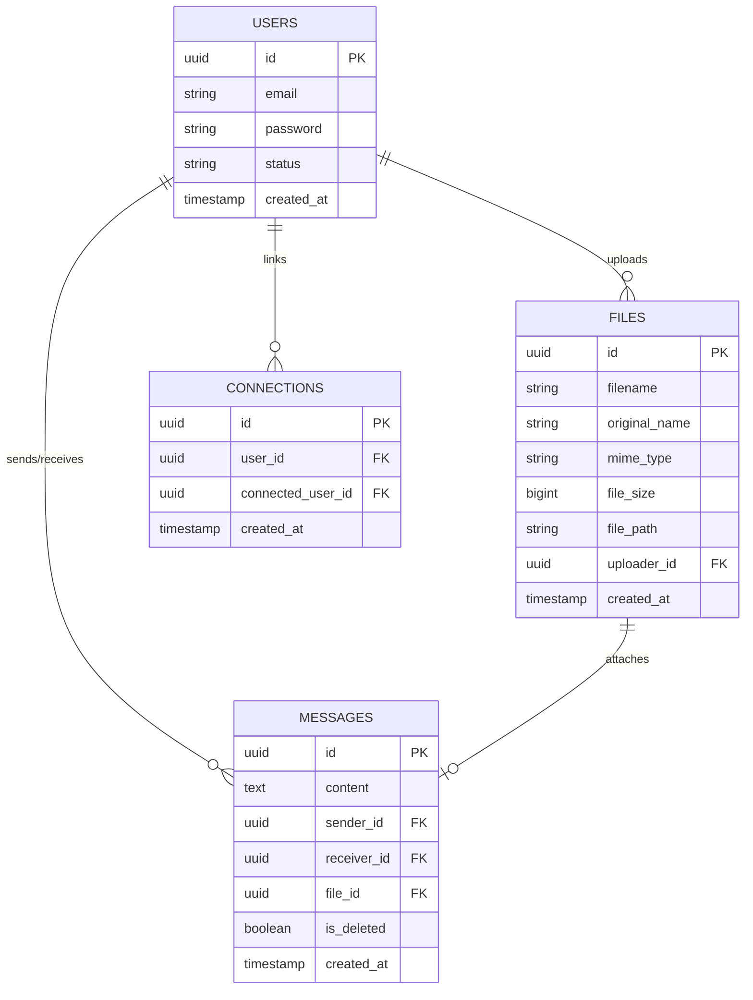

# Real-Time Secure Communication & File Sharing API

A professional, high-performance backend system built for secure, real-time messaging and file sharing. This system prioritizes security through token rotation, peppered password hashing, authenticated WebSocket communication, and OTP-based verification.

### 🌐 Live Deployment

- **Frontend**: [https://yatri-car-rental-ten.vercel.app/](https://yatri-car-rental-ten.vercel.app/)
- **Backend API**: [https://yatri-car-rental-task.onrender.com](https://yatri-car-rental-task.onrender.com)

---

## 🛠️ Technology Stack

- **Runtime**: Node.js (Express.js)
- **Database**: PostgreSQL (Raw Queries via `pg` pool)
- **Caching/Session**: Redis (Upstash)
- **Real-Time**: Socket.io
- **Testing**: Jest & Supertest
- **File Handling**: Multer
- **Mail**: Nodemailer

---

## ⚙️ Setup & Installation

Follow these steps to get the project running locally:

### **1. Prerequisites**

- Node.js (v16 or higher)
- PostgreSQL Database
- Redis Instance
- SMTP Server (e.g., Gmail, Mailtrap)

### **2. Install Dependencies**

```bash
npm install
```

### **3. Environment Configuration**

Create a `.env` file in the `backend` directory and add the following:

```env
PORT=5000
DATABASE_URL=your_postgresql_url
REDIS_URL=your_redis_url
JWT_ACCESS_SECRET=your_access_secret
JWT_REFRESH_SECRET=your_refresh_secret
JWT_ACCESS_EXPIRATION=15m
JWT_REFRESH_EXPIRATION=7d
EMAIL_SERVICE=gmail
EMAIL_USER=your_email@gmail.com
EMAIL_PASS=your_app_password
PEPPER=your_random_pepper_string
```

### **4. Database Initialization**

Run the SQL commands provided in `backend/database/schema.sql` against your PostgreSQL database to create the necessary tables and indexes.

### **5. Run the Server**

```bash
# Development mode
npm run dev

# Production mode
npm start
```

### **6. Run Tests**

```bash
npm test
```

---

## 📡 API Endpoints

### **1. Authentication (Auth)**

| Method   | Endpoint            | Description      | Headers                | Body                                    | Example Response                                                                     |
| :------- | :------------------ | :--------------- | :--------------------- | :-------------------------------------- | :----------------------------------------------------------------------------------- |
| **POST** | `/api/auth/signup`  | Register a user  | None                   | `{ "email": "...", "password": "..." }` | `{ "success": true, "message": "User registered. Verify OTP." }`                     |
| **POST** | `/api/auth/verify`  | Verify OTP       | None                   | `{ "email": "...", "otp": "..." }`      | `{ "success": true, "message": "Email verified." }`                                  |
| **POST** | `/api/auth/signin`  | Login            | None                   | `{ "email": "...", "password": "..." }` | `{ "success": true, "accessToken": "...", "user": { "id": "...", "email": "..." } }` |
| **POST** | `/api/auth/refresh` | New Access Token | Cookie: `refreshToken` | None                                    | `{ "success": true, "accessToken": "..." }`                                          |
| **POST** | `/api/auth/logout`  | End session      | Cookie: `refreshToken` | None                                    | `{ "success": true, "message": "Logged out" }`                                       |
| **GET**  | `/api/auth/search`  | Find user        | Auth: `Bearer <token>` | None                                    | `{ "success": true, "user": { "id": "...", "email": "..." } }`                       |

### **2. Messaging (Messages)**

| Method     | Endpoint                   | Description    | Headers                | Body                                                           | Example Response                                                 |
| :--------- | :------------------------- | :------------- | :--------------------- | :------------------------------------------------------------- | :--------------------------------------------------------------- |
| **POST**   | `/api/messages`            | Send message   | Auth: `Bearer <token>` | `{ "receiver_id": "...", "content": "...", "file_id": "..." }` | `{ "success": true, "data": { "id": "...", "content": "..." } }` |
| **GET**    | `/api/messages/:userId`    | Get history    | Auth: `Bearer <token>` | None                                                           | `{ "success": true, "data": [...] }`                             |
| **PUT**    | `/api/messages/:messageId` | Update message | Auth: `Bearer <token>` | `{ "content": "..." }`                                         | `{ "success": true, "data": { "id": "...", "content": "..." } }` |
| **DELETE** | `/api/messages/:messageId` | Delete message | Auth: `Bearer <token>` | None                                                           | `{ "success": true, "message": "Deleted" }`                      |

### **3. File Sharing (Files)**

| Method   | Endpoint            | Description | Headers                | Content-Type          | Example Response                                                   |
| :------- | :------------------ | :---------- | :--------------------- | :-------------------- | :----------------------------------------------------------------- |
| **POST** | `/api/files/upload` | Upload file | Auth: `Bearer <token>` | `multipart/form-data` | `{ "success": true, "file": { "id": "...", "file_path": "..." } }` |

---

## 🔌 Real-Time WebSockets (Socket.io)

### **Implementation Details**:

WebSockets are integrated using **Socket.io** to provide low-latency updates.

1.  **Handshake Authentication**: Connections are authenticated using the JWT Access Token provided in the `auth` object:
    ```javascript
    const socket = io(URL, { auth: { token: "ACCESS_TOKEN" } });
    ```
2.  **Private User Rooms**: Upon connection, every user sticks to a private room: `user_${userId}`. This allows targeted delivery.
3.  **Real-Time Events**:
    - `new_message`: Triggered on `POST /api/messages` to notify the recipient.
    - `EDIT_MESSAGE`: Triggered when a message is updated.
    - `DELETE_MESSAGE`: Triggered when a message is deleted.
    - `NEW_CONNECTION`: Triggered when two users are linked.

---

## ⚡ Technology Explanation

### **JWT/Refresh Token Session Flow**

1.  **Access Token**: Short-lived (15m) for regular API requests. Verified via a secret.
2.  **Refresh Token**: Long-lived (7d) stored in **Redis** and an **HTTP-only cookie**.
3.  **Rotation Mechanism**: During refresh, the backend validates the token in Redis, deletes it, and issues a **brand new pair**. This prevents session hijacking if a token is leaked.

### **Redis Data Structures**

- **OTP Storage**: Key: `OTP:${email}`, Value: `6-digit code`, TTL: `300s`.
- **Refresh Token Storage**: Key: `REFRESH:${userId}`, Value: `JWT-String`, TTL: `604800s`. This allows server-side session invalidation on logout.

### **Security Multi-Layering**

- **Password Pepper**: A server-side static string concatenated with the password before hashing.
- **Soft Deletes**: Deletions mark rows as `is_deleted = true` instead of removing them, maintaining audit trails.
- **CORS Polish**: Secure origin white-listing for the production environment.

---

## 🗄️ Database Design



---

## 🧪 Jest Unit Testing

The project includes a robust testing suite implemented with **Jest** and **Supertest** to ensure reliability of critical business logic.

### **1. Authentication Tests (`tests/auth.test.js`)**

- **Signup Logic**: Verifies that new users are correctly saved as `Unverified` and that duplicate emails are rejected.
- **Password Security**: Confirms that passwords are concatenated with the server-side **PEPPER** before hashing.
- **OTP Validation**:
  - Tests successful verification when the code matches Redis.
  - Tests failure cases for incorrect or expired OTPs.
- **JWT Generation**: Validates that both `accessToken` and `refreshToken` are issued upon successful sign-in.
- **Status Checks**: Ensures only users with `Verified` status can authenticate.

### **2. Messaging CRUD Tests (`tests/message.test.js`)**

- **Message Creation**: Tests the `POST /api/messages` endpoint to ensure messages are persisted to the database.
- **Recipient Verification**: Validates that messages can only be sent to existing, verified users.
- **History Retrieval**: Tests the `GET /api/messages/:userId` logic for fetching bidirectional chat history.
- **Real-Time Triggering**: Mocks the WebSocket `emitToUser` function to verify that real-time signals are triggered immediately after a message is saved to the DB.

### **How to Run Tests**

```bash
npm test
```
